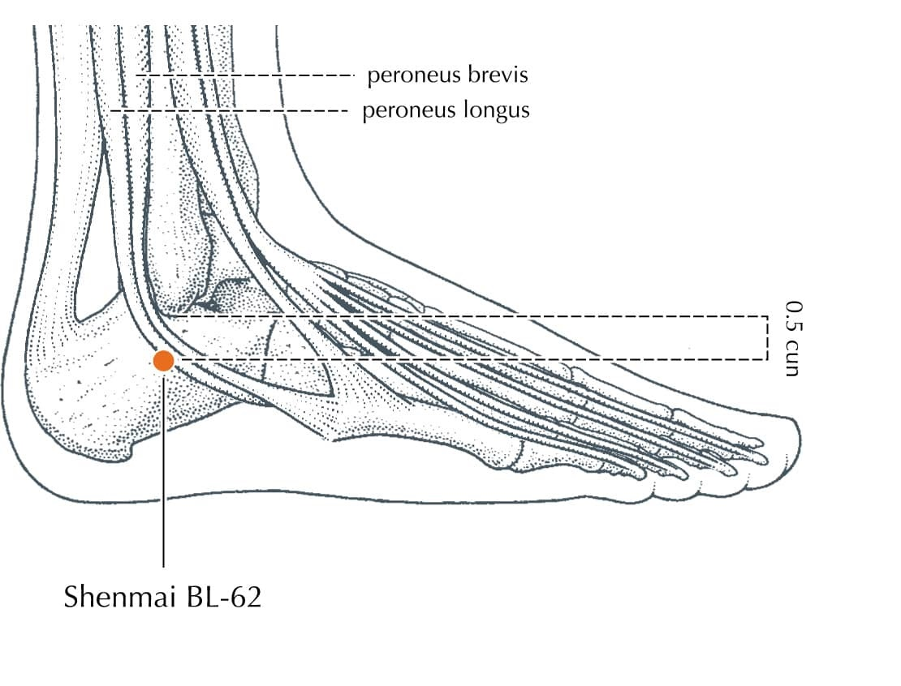

# Ling Gui Ba Fa Calculator

This project is a web-based calculator for determining the open acupuncture point (Ling Gui Ba Fa) based on traditional Chinese medicine principles and the sexagenary cycle. The app displays the open point, its image, and a detailed location and description for each point.

## How It Works
- Enter a date and time to calculate the open point.
- The app shows the point code, name, image, and a description of its location and function.

---

# Points Reference

## SI-3 (DUMO)

- **Location:** On the ulnar border of the hand, in the substantial depression proximal to the head of the fifth metacarpal bone
- **Description:**
  > Dumo is the main Yang meridian.
  > When Dumo is overactive there are occurrences of headaches (congestive) with pain extending over the eyes. There may be spinal stiffness.
  > When Dumo is chronically deficient in energy the patient tends to be stoop shouldered, and tend to suffer from a feeling of dullness and heaviness in the head.
  > Given the above characteristic symptoms, the key point of Dumo as extra meridian (in association with others) relates to Conjunctivitis, frontal neuralgia, febrile dísease, hemorrhoids, hernia, lumbago, neck pains, phlegmatic coughs, running eyes, urine retention, sterility.

---

## LU-7 (JENMO)

- **Location:** On the radial aspect of the forearm, approximately 1.5 cun proximal to LI-5, in the cleft between the tendons of brachioradialis and abductor pollicis longus
- **Description:**
  > Jenmo is the main Yin meridian.
  > Energy deficiency in the Jenmo channel tends to manifest itself in scanty or suppressed menstruation, skin disorders (pimples, itch, etc.). Excess manifests as painful, or/and profuse menstruation. In both cases there is fatigue and emotional imbalance.
  > Given these characteristics its key extra meridian point is indicated in asthma, bronchitis, coughs, difficult breathing, dyspepsia, epilepsy (with yinweimo), eczema, hernia, head and neck pain, pneumonia, urogenital problems. Along with Yinweimo it corresponds with the host of female problems, including sterility, and the tendency to miscarriage.

---

## SP-4 (CHUNGMO)

- **Location:** On the medial side of the foot, in the depression distal and inferior to the base of the first metatarsal bone
- **Description:**
  > Chungmo is the reservoir of hereditary Chi and Ching. It is therefore the foundation for eradicating hereditary and constitutional weaknesses. I.e., all problems that can be tied into inheritance, and constitutional debility.

---

## GB-41 (TAIMO)

- **Location:** Ask the patient to abduct their little toe in order to make the branch of m.extensor digitorum longus more prominent. Run a finger from GB-43 towards the ankle, along the interspace between the fourth and fifth metatarsals until it passes over this branch into the significant depression immediately beyond the tendon
- **Description:**
  > Taimo is used in conjunction with Yangweimo

---

## KI-6 (YINCHAIMO)

- **Location:** 1 cun below the prominence of the medial malleolus, in the groove formed by two ligamentous bundles
- **Description:**
  > It is a master yin meridian, and its characteristic symptom is fluid retention, venous stagnation and all their attendant symptoms (coldness, heat flashes, circulatory disturbances, varicose veins, etc.).
  > Given these characteristics it is indicated in Sexual debility (male & female) and lack of pleasure, difficult childbirth, cystitis, constipation, motor impairment of legs, toxic pregnancy, bladder weakness and hypersomnia.

---

## BL-62 (YANGCHAIMO)

- **Location:** On the lateral side of the foot, approximately 0.5 cun inferior to the inferior border of the lateral malleolus, in a depression posterior of the peroneal tendons
- **Description:**
  > It is a master yang meridian, and its characteristic symptoms are a tendency to high blood pressure, locomotion and articulation problems, lumbago, rheumatism (showing its affinity for the adrenal cortex). Its overactivity leads to obsessions, manic depressive states, paranoia, insomnía, spasms, epilepsy,etc.

---

## PC-6 (YINWEIMO)

- **Location:** On the flexor aspect of the forearm, 2 cun proximal to PC-7, between the tendons of palmaris longus and flexor carpi radialis
- **Description:**
  > Deficiency in the yinweimo is indicated in pain in the genitals, especially in women during coition. It is indicated in people who have a history of excess coldness (lack of animal heat).
  > Given these characteristics it is indicated for emotional instability, timidity, nervousness (which is usually concealed through laughter), anxiety and apprehension amnesia, nightmares, cardiac pain, indigestion, constipation, varicose veins, etc

---

## SJ-5 (YANGWEIMO)

- **Location:** 2 cun proximal to SJ-4, in the depression between the radius and the ulna, on the radial side of the extensor digitorum communis tendons
- **Description:**
  > Yangweimo has the main function of protecting the body from external hazards, as well as adjusting the body to the external environment. Its deficiency is indicated by poor resistance to infection, and adjusting to cold temperatures. 